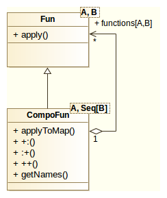

<h1>Scala Patterns</h1>

<h2>Scope</h2>
This small projects serves as a minimal repository of know how how that I gather out of my own experience.

There is no clear objective to cover GoF design patterns or the functional design patterns. However, over time, more of my favorite GoFs might end up here.
<h2><a href="#patterns"/>Patterns</h2>
<h3><a href="#multifun"/>Composite Functions</h3>
<h4>Description</h4>
This pattern is built on top of the GoF Composite pattern, but with a twist. The composition is just appending the component results to a sequence of results, preserving the order of the components.

The component is a <code>Fun</code> object, the composite is a <code>MultiFun</code> object and the <code>operation()</code> is <code>apply()</code>.

One can think of it as a a list of inputs of the same type that need to be transformed into a different list of outputs of the same or a different type.

Normally, and probably in most of the cases one will build a class or a data structure that will hold the result of the complex computations. In my case I decided that I want more flexibility and I want to build different 'processors' with complex computations, producing different results without being bound to define a different structure for each result type.

<h4>Elements</h4>

<b><code>Fun</code></b> is a wrapper class for <code>Function1</code> which can also create named functions.

<b><code>MultiFun</code></b> is a <code>Fun</code> container containing a sequence of functions that are applied to the same input.

In essence, the <code>MultiFun</code> is a function of <code>A => Seq[B]</code> which results from applying the same input of type <code>A</code> to a sequence of functions <code>A => B</code>.

<h4>Recommendations</h4>
<ul>
<li>Use case classes for the input parameter instead of tuples. It adds a little overhead, but in the case of this pattern it makes sense, as everything is bult on top of <code>Function1</code>.</li>
<li>If possible it is better to use a specific return type, e.g. Seq[String] or Seq[Specific_Class] rather than Seq[Any].</li>
<li>If the library of MultiFuns is growing it is better to use named functions: <code>Fun(name, body)</code>.
</ul>

<h4>Usage Sample</h4>

Let's say that we have a couple of specific functions retrieving  price for a given product from an online store (e.g. Amazon, EBay, Alibaba...) and we would like to retrieve the prices for all of them so that we can display them in a comparison table.
We can agregate the functions in a <code>MultiFun</code> structure and just apply this composite function to the given input resulting in a list (or a map) of return values.

<code>
...

    case class Product(name: String, specifications: Map[String, String])
    case class Price(value: Double, currency: String)

    def getPriceFromAmazon_COM(product: Product): Price = ???
    def getPriceFromAmazon_UK(product: Product): Price = ???
    def getPriceFromAmazon_DE(product: Product): Price = ???
    def getPriceFromEBay(product: Product): Price = ???
    def getPriceFromAlibaba(product: Product): Price = ???

    def getAmazonPrices = MultiFun(List(Fun("amazon.com", getPriceFromAmazon_COM),
      Fun("amazon.uk", getPriceFromAmazon_UK),
      Fun("amazon.de", getPriceFromAmazon_DE)))

    def getOffersMainStores = getAmazonPrices ++ MultiFun(List(Fun("ebay", getPriceFromEBay),
      Fun("alibaba", getPriceFromAlibaba)))

    val interestingProduct = Product("Programming in Scala", Map("author" -> "Martin Odersky and Lex Spoon", "type" -> "Paperback"))

    val amazonPrices = getAmazonPrices(interestingProduct)
    val mainStorePrices = getOffersMainStores.applyToMap(interestingProduct)
... 
</code>

<h4>Known Problems, Limitations</h4> 
<ul>
<li>Because of type erasure it is difficult to infer the type of the input parameter, especially when using tuples. Even though it adds a little overhead it is better to write a case class for the input instead of using a tuple.</li>

</ul>

<h2><a href="#references"/>References</h2>
<ul>
<li>Scala Design Patterns: Patterns for Practical Reuse and Design <i>by John Hunt</i></li>
<li>Design Patterns: Elements of Reusable Object-Oriented Software <i>by Erich Gamma, Richard Helm, Ralph Johnson, John Vlissides</i></li>
</ul>